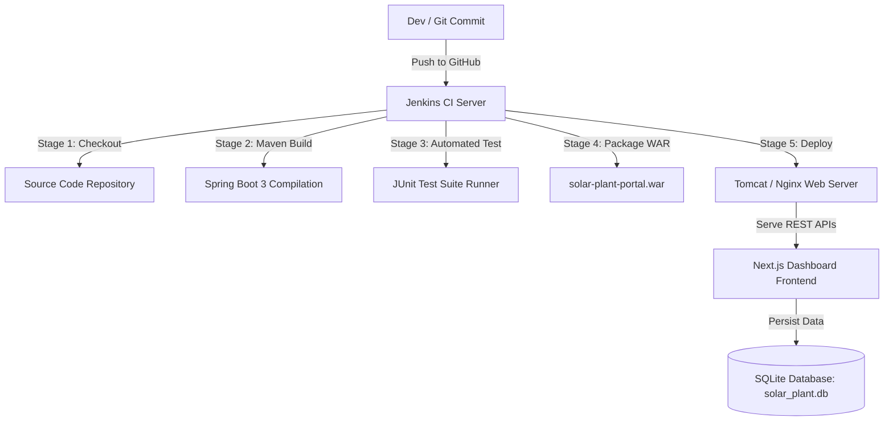

# ☀️ Solar Plant Maintenance Portal — CI/CD DevOps Pipeline

> **Student Name**: NAVNATH KADAM  
> **Student ID**: 23102B0061  
> **Project Scope**: Solar Plant Asset Monitoring & Maintenance Portal  
> **Lab Focus (Lab-4)**: Building Jenkins CI/CD Pipeline using Maven, Automated Unit Testing, WAR Packaging, and Tomcat / Nginx Deployment.

---

## 📌 Executive Summary & Architecture Overview

The **Solar Plant Maintenance Portal** is an enterprise-grade full-stack application designed to streamline solar asset operations. It provides real-time monitoring of solar array power generation (MW), tracker motor faults, inverter temperatures, dust accumulation alerts, and a **Role-Based Status Workflow** (`PENDING` ➔ `IN_PROGRESS` ➔ `RESOLVED`).

The system is built specifically for **DevOps CI/CD Automation**:
- **Frontend**: Next.js (React framework) featuring a glassmorphism design system, dark mode metrics dashboard, and interactive maintenance ticket management.
- **Backend**: Java Spring Boot 3 with Maven (`pom.xml`), REST APIs, and embedded SQLite database.
- **Database**: Zero-configuration embedded SQLite database (`solar_plant.db`).
- **CI/CD Automation (Lab-4)**: Declarative `Jenkinsfile` automated pipeline with SCM checkout, Maven compilation, JUnit test execution, WAR packaging, and parameterized deployment to Tomcat / Nginx servers.



---

## 📁 Professional Directory & File Structure

```
solar-panel-devops/
├── Jenkinsfile                      # Lab-4 Declarative Jenkins CI/CD Pipeline Script
├── README.md                        # Enterprise Technical Documentation & Architectural Flow
├── .gitignore                       # Ignored build artefacts, node_modules, and DB files
│
├── backend/                         # Java Spring Boot Maven Application
│   ├── pom.xml                      # Maven Build Config (SQLite, JPA, WAR Packaging)
│   ├── mvnw.cmd                     # Windows Maven Wrapper Executable
│   │
│   └── src/
│       ├── main/
│       │   ├── java/com/solar/portal/
│       │   │   ├── SolarPortalApplication.java # Entry Point with Tomcat ServletInitializer
│       │   │   ├── config/
│       │   │   │   └── WebConfig.java          # Cross-Origin (CORS) Configuration
│       │   │   ├── controller/
│       │   │   │   ├── MaintenanceController.java # CRUD & Role Workflow REST Endpoints
│       │   │   │   ├── DashboardController.java   # Solar Analytics & Power Stats API
│       │   │   │   └── HealthController.java      # Deployment Health & Info Endpoints
│       │   │   ├── model/
│       │   │   │   └── MaintenanceRecord.java     # JPA Entity for Solar Maintenance
│       │   │   └── repository/
│       │   │       └── MaintenanceRecordRepository.java # JPA Repository for SQLite
│       │   └── resources/
│       │       └── application.properties       # SQLite JDBC & Hibernate Config
│       │
│       └── test/
│           └── java/com/solar/portal/
│               └── SolarPortalApplicationTests.java # Automated JUnit Unit Tests
│
└── frontend/                        # Next.js React Dashboard Application
    ├── package.json                 # Next.js & Lucide React Dependencies
    ├── next.config.js               # API Proxy Rewrites to Backend (Port 8080)
    ├── tsconfig.json                # TypeScript Compiler Configuration
    └── src/
        ├── app/
        │   ├── globals.css          # Glassmorphism Design System & HSL Theme
        │   ├── layout.tsx           # Next.js Root Layout Component
        │   └── page.tsx             # Interactive Dashboard Page & State Handlers
        └── components/
            ├── Header.tsx           # Header Banner with Live Server Status
            ├── MetricsOverview.tsx  # Solar Power Output & SLA Stat Cards
            ├── MaintenanceTable.tsx # CRUD Table with Search, Filter & Role Switches
            ├── TicketModal.tsx      # Modal Dialog for Creating/Editing Records
            └── WorkflowGuide.tsx    # Visual Lab-4 Pipeline Flow Walkthrough
```

---

## ⚡ REST API Endpoint Specifications

| HTTP Method | Endpoint Path | Description | Access Role |
| :--- | :--- | :--- | :--- |
| `GET` | `/api/health` | Deployment Health Check status (`UP` / `DOWN`) | Public / Jenkins |
| `GET` | `/api/info` | Application metadata and build target info | Public |
| `GET` | `/api/records` | Retrieve all maintenance tickets (supports `?search=` and `?status=`) | Technician / Manager |
| `GET` | `/api/records/{id}` | Get ticket details by ID | Technician / Manager |
| `POST` | `/api/records` | Log a new solar plant maintenance record | Technician |
| `PUT` | `/api/records/{id}` | Update existing record details | Technician / Manager |
| `PATCH` | `/api/records/{id}/status` | Advance role status workflow (`PENDING` ➔ `IN_PROGRESS` ➔ `RESOLVED`) | Technician / Manager |
| `DELETE` | `/api/records/{id}` | Remove maintenance record | Manager |
| `GET` | `/api/dashboard/stats` | Aggregate solar output (MW), SLA %, and alert counts | Public / Dashboard |

---

## 🔄 Detailed Architectural & Data Flow Explanation

### 1. Request Lifecycle (User ➔ Frontend ➔ REST API ➔ Database)
1. **User Action**: A Field Technician logs a maintenance issue (e.g., *Tracker Motor Stalled in Sector D*).
2. **Next.js Frontend**: `page.tsx` submits a JSON payload to `/api/records`.
3. **CORS & Routing**: `WebConfig.java` validates origins and forwards request to `MaintenanceController`.
4. **Spring Data JPA**: `MaintenanceRecordRepository` executes an SQL `INSERT` statement into `solar_plant.db`.
5. **UI Update**: `MetricsOverview.tsx` updates live generation stats (MW) and active alert counts instantly.

### 2. Role-Based Workflow State Engine
- **PENDING**: New issue logged by system monitor or technician.
- **IN_PROGRESS**: Technician accepts ticket, clicks **Start Work**, and begins field repairs.
- **RESOLVED**: Maintenance completed; inverter efficiency returns to optimal levels.
- **RE-OPEN (Manager Only)**: Manager inspects repairs and can re-open ticket if efficiency remains below threshold.

---

## 🚀 Lab-4 Jenkins CI/CD Pipeline Flow (`Jenkinsfile`)

The included `Jenkinsfile` automates the complete continuous integration and deployment pipeline:

```groovy
pipeline {
    agent any
    parameters {
        choice(name: 'TARGET_ENV', choices: ['STAGING', 'PRODUCTION', 'DEVELOPMENT'])
        string(name: 'TOMCAT_WEBAPPS_DIR', defaultValue: 'C:/Program Files/Apache Software Foundation/Tomcat 10.1/webapps')
        string(name: 'DEPLOY_PORT', defaultValue: '8080')
    }
    ...
```

### Pipeline Execution Stages:
1. **Stage 1: Checkout Source Code**: Clones the GitHub repository baseline.
2. **Stage 2: Environment Verification**: Ensures JDK 21 and build tools are active.
3. **Stage 3: Backend Maven Build**: Executes `mvnw.cmd clean compile` inside `/backend`.
4. **Stage 4: Automated Testing**: Executes JUnit test suite `mvnw.cmd test` and publishes XML test reports.
5. **Stage 5: Package WAR Artefact**: Builds `solar-plant-portal.war` using `maven-war-plugin`.
6. **Stage 6: Deploy to Tomcat / Nginx**: Copies `.war` to target Tomcat `webapps/` directory or updates Nginx upstream server.
7. **Stage 7: Health Verification**: Queries `/api/health` to confirm server deployment status.
8. **Post Build**: Archives `.war` build artifact in Jenkins.

---

## 🛠️ Step-by-Step Local Execution Guide

### Prerequisites
- Node.js (v18+)
- Java JDK 21 (Available in system extensions)

### 1. Launching Backend (Spring Boot + SQLite)
```powershell
cd "d:\Full Stack Projects\solar-panel-devops\backend"

# Run Maven build & start server
.\mvnw.cmd spring-boot:run
```
> Server starts at `http://localhost:8080`.  
> Test health: `http://localhost:8080/api/health`

### 2. Launching Frontend (Next.js)
```powershell
cd "d:\Full Stack Projects\solar-panel-devops\frontend"

# Install dependencies & start dev server
npm install
npm run dev
```
> Open browser at `http://localhost:3000`.

---

## 📜 Academic Verification & Lab-4 Checklist

- [x] **Spring Boot & Maven Setup**: Complete `pom.xml` with dependencies for Web, JPA, SQLite, and WAR packaging.
- [x] **Database Persistence**: SQLite database initialized with entity mapping and initial sample records.
- [x] **Full-Stack Application**: Next.js React frontend dashboard connected to Spring Boot REST APIs.
- [x] **Jenkinsfile Pipeline**: Declarative multi-stage pipeline script for Maven compile, JUnit test, WAR build, and Tomcat deploy.
- [x] **Documentation**: Complete architectural flow, REST API list, and directory structure guide.
